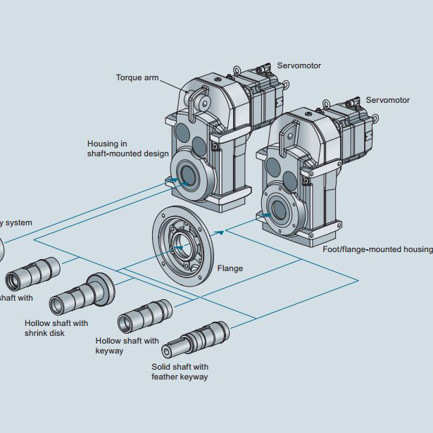

Gear-box Mechanical Design for Conveyors consisted of following stages 

### Defining the Mechanical constraints
This involved fining out the expected constraints from the manufacturer as Reduction Ratio, Power Rating, the envelope dimensions of the gearbox
### Layout and material selection
This stage involved selection of appropriate material selection for the gears and the shafts mounted upon it. The material with sufficient Bending Strength and mechanical properties was S45C with 0.45% Carbon in Steel. Also the gears chosen where spur gears with a Planetary Gearbox layout for compaction. 
### Design
Once the mechanical properties were fixed depending upon the material and gear selection, we started the iteration process for Mechanical Design. We verified the Bending and wear strength required for given Power and Torque constraints, and found that material chosen had enough margin above theoretical strength to withstand

For more information, please see my github page: <a href="https://github.com/ManthanND/Hamoye_Stage_D">
<i class="large github icon "></i>Planetary Gear-Box Design</a>.

