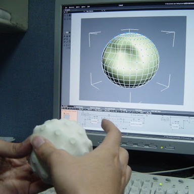

In this project effort was made to reproduce the Dynamic Shape Shifting Tangible User Interface Display made in MIT inform Labs. The project constituted following things.

### Literature review for various Dynamic Shape Shifters
This consisted of surveying and benchmarking many existing Dynamic Shape Shifters, some of which included Smart Memory alloys, Cellular Solids, Soft robotics and Tangible User Interfaces.
### Tangible user Interfacing
Once the domain was narrowed to follow TUI’s for shapeshifting, due to numerous advantages like Virtual and Rapid Prototyping and cost effectiveness against Shape memory alloys, we dived further in selecting inform 3D shape shifting blocks for reproducing.
### Mechatronic System Design
In order to convert a 3D .step or .iges file format into physical but temporary product, it was necessary to select the embedded backbone mechanism. Raspberry pie along with linear actuators (pneumatic cylinders) was selected for the same.
### Cube Selection Algorithm design
After the sensor-actuator circuitry design was ready, we coded for a planar segmentation and cube selection algorithm. This divided the entire step 3D model into number of raising cubes, which allowed for correct selection of the element to raise and the length of extension.
For more information, please see my github page: <a href="https://github.com/ManthanND/Hamoye_Stage_D">
<i class="large github icon "></i>Tangible User Interface Design</a>.

